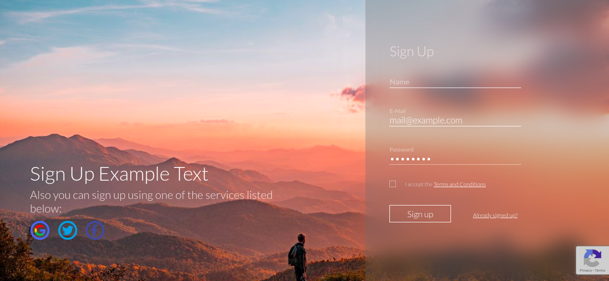

# react-login-screen
Login and Sign Up screen made with React (TypeScript) and with MongoDB on the backend

 
## Usage 
Run "npm install" in both web and server directories then in main directory run "yarn dev"
If you want to use Recaptcha or login with 3rd party websites you will have to fill in .env files in [web](web/) and [server](server/) directories.

## License
[GNU GPLv3](https://choosealicense.com/licenses/gpl-3.0/)